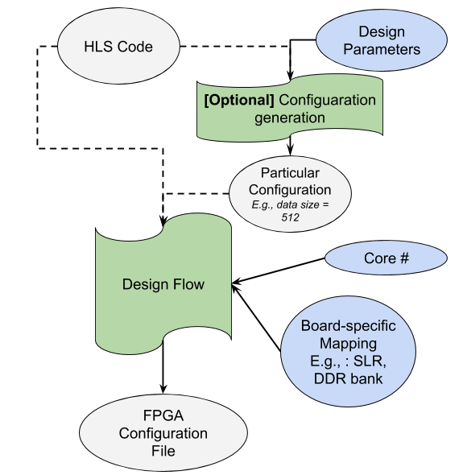
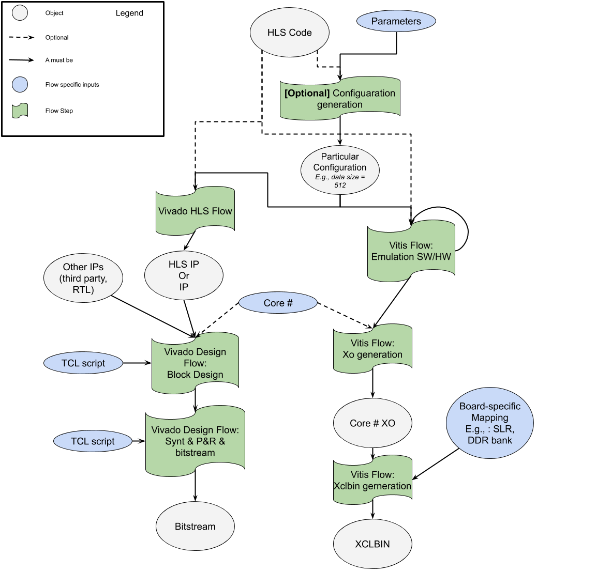

# Xlnx-project-template



This repository aims at providing a possible template with a set of common utilities, such as makefile, tcl scripts etc.

The flow in three simple way

1. I have HLS code, and I want to just go thorough the standard flow (hls simulation, synthesis, cosimulation, export) and then just generate the final FPGA configuration file (e.g., ".bit", ".xclbin"), then this repo can provide you simple base scripts.

2. If you want to go for the same flow but, I want to create multiple configuration of my design, e.g., I wan to change data-size, data types etc., then this repo could help you for a simple way to do this.

3. If you want to do both the flows and add a multi-core design, then  this repo can help you.


## Code organization
* `build/` build folder, where the magic happens without being on git
* `images/` some useful images
* `platforms/` specific platforms makefile for the current supported boards: Pynq-Z2, Ultra96, Zcu104, Alveo u200
* `src/` source code for HLS based design, miscellaneous utilities, python host and testing code, and various scripts
  * `driver/` cpp source code driver for Zynq with Pynq framework (borrowed from [Xilinx BNN-PYNQ repository](https://github.com/Xilinx/BNN-PYNQ), pleaser refer to that repo for the license and the property of Xilinx company).
  * `hls/` HLS source code for both design and testbench in subfolder `hls/testbench/`.
  * `misc/` this folder contains only the board definition files (BDF), that are properties of the board producer, we report here just for the sake of the user.
  * `scripts/` miscellaneous scripts for the design generation, from tcl for Vivado and Vivado HLS to design configurator and design results extractions
  * `sw/` software code bases, for host mainly
    * `hostcpp/` cpp host code for Zynq with Pynq and for PCIe card, such as Alveo
    * `python/` python host source code for Pynq based platforms

## Toy Example Description
This repository template use a toy example accelerator we call "drambenchmark", a simple copy of "DATA_ARRAY_SIZE", 10000 as default, data from the DDR Dram to a FPGA local memory, then write back to a different DDR location. The data transfer are packed in a packet of "INPUT_BIWIDTH" dimension, 512 as default

## Fixed Instance Accelerator flow

1. a) `make hw TRGT_PLATFORM=ultra96_v2` for generating an instance of the design for the Ultra96
1. b) `make xclbin TARGET=hw OPT_LVL=3 CLK_FRQ=$FREQZ TRGT_PLATFORM=alveo_u200`  for generating an instance of the design on the Alveo u200 with target clock frequency `CLK_FRQ=$FREQZ`

## FPGA-based accelerator generation flow

1. a) `make hw_gen TRGT_PLATFORM=ultra96_v2` for generating an instance of the design for the Ultra96
1. b) `make xclbin_config TARGET=hw OPT_LVL=3 CLK_FRQ=$FREQZ TRGT_PLATFORM=alveo_u200`  for generating an instance of the design on the Alveo u200 with target clock frequency `CLK_FRQ=$FREQZ`
2. [Optional] Generate other instances changing the design parameters. Look at Makefile parameters section for details.

## Vitis PCIe card Emulation Flow
1. `make run TARGET=sw_emu` for fixed file sw_emu flow, change to hw_emu for an hardware emulation
2. `make run_config TARGET=sw_emu` generate a specific configuration of the accelerator and emulate (a single core with the current host)

## HLS stand alone flow
 1. `make hls HLS_OPTS=1` create the hls project and simulate, change HLS_OPTS according to the description below
 2. `make hls_config HLS_OPTS=1`, as above, but with the generation of the new hls accelerator

## Testing designs

WARNING NOT YET TESTED THIS FLOW  

1. Complete at least one design in the previous section
2. `make sw`create a deploy folder for the python code
3. `make deploy BRD_IP=<target_ip> BRD_USR=<user_name_on_remote_host> BRD_DIR=<path_to_copy>` copy onto the deploy folders the needed files
4. connect to the remote device, i.e., via ssh `ssh <user_name_on_remote_host>@<target_ip>`
5. [Optional] install all needed python packages
6. set `BITSTREAM=<path_to_bits>`, `CLK=200`, `CORE_NR=<target_core_numbers>`, `PLATFORM=Alveo|Zynq`, `RES_PATH=path_results`
7. Execute the test 

### Makefile parameters

Follows some makefile parameters

#### General makefile parameters, and design configuration parameter
* TRGT_PLATFORM=`pynqz2|ultra96_v2|zcu10|alveo_u200`
* AXI input packet bits IBW=`8|16|32|64|128|256|512`
* Number of AXI packet to transfer ARRSZ=`Any number| default 1000`
* Core Number CORE_NR=`1|2|3|4`

#### Vivado and Zynq specific parameters flow
* HLS_CLK=`default 10` clock period for hls"
* FREQ_MHZ=`150` clock frequency for vivado bitstream generation
* TOP_LVL_FN=`drambenchmark_top` target top function for HLS
* HLS_OPTS=`5` 
* 0 for only project build; 1 for sim only; 2 synth; 3 cosim; 4 synth and ip downto impl; 5 synth and ip; 6 for ip export

#### Alveo specific parameters flow
* REPORT_FLAG=`R0|R1|R2` to report detail levels
* OPT_LVL=`0|1|2|3|s|quick` to optimization levels"
* CLK_FRQ=`<target_mhz>` to ClockID 0 (board) target frequency, should be PCIe clock
* KRNL_FRQ=`<target_mhz>` to ClockID 1 (kernel) target frequency or RTL secondary clock"


#### Complete Flow Overview



#### Credits and Contributors

Contributors: Davide Conficconi, Emanuele Del Sozzo, Eleonora D'Arnese

If you find this repository useful, please use the following citation(s):

```
@inproceedings{iron2021,
author = {Conficconi, Davide and D'Arnese, Eleonora and Del Sozzo, Emanuele, and Sciuto, Donatella, and Santambrogio, Marco D.},
title = {A Framework for Customizable FPGA-based Image Registration Accelerators},
booktitle = {The 2021 ACM/SIGDA International Symposium on Field-Programmable Gate Arrays},
series = {FPGA '21},
year = {2021}
}
```
